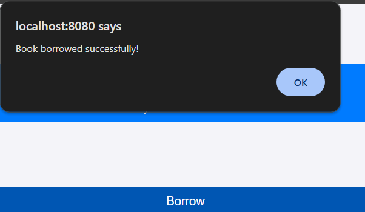

### **README for the Library Management System**

---

## **Project Overview**

The **Library Management System** is a web-based application designed to manage a library's books and users. It simplifies operations such as user registration, login, book borrowing, and book return. The system utilizes **Spring Boot** for the backend, **Thymeleaf** for the frontend, and **Spring Security** for authentication and authorization.

---

## **Key Features**

1. **User Registration and Authentication:**
    - Secure user registration with password encryption using `BCrypt`.
    - User login with Spring Security.
    - Redirection to a personalized homepage after successful login.

2. **Book Management:**
    - View all available books.
    - Borrow books (decrease available copies).
    - Return borrowed books (increase available copies).

3. **User Dashboard:**
    - View books currently borrowed by the user.
    - Access options to return borrowed books.

4. **RESTful API Endpoints:**
    - Manage books and borrow records programmatically.

---

## **Project Structure**

```plaintext
src
├── main
│   ├── java
│   │   └── com.library
│   │       ├── controller          # Controllers for handling HTTP requests
│   │       ├── model               # Entity classes for database
│   │       ├── repository          # Interfaces for database interaction
│   │       ├── service             # Business logic for books and borrow management
│   │       └── config              # Security and application configuration
│   ├── resources
│   │   ├── templates               # Thymeleaf templates for UI (home, login, etc.)
│   │   └── application.properties  # Configuration settings
└── test                            # Unit and integration tests
```

---

## **API Endpoints**

### **Authentication API**
| Method | Endpoint         | Description                     |
|--------|------------------|---------------------------------|
| POST   | `/login`         | User login.                    |
| GET    | `/logout`        | Logout the user.               |

---

### **Book API**
| Method | Endpoint             | Description                              |
|--------|----------------------|------------------------------------------|
| GET    | `/api/books`         | Fetch all books.                        |
| GET    | `/api/books/{id}`    | Fetch details of a specific book.       |
| POST   | `/api/books`         | Add a new book.                         |
| PUT    | `/api/books/{id}`    | Update details of an existing book.     |
| DELETE | `/api/books/{id}`    | Delete a book.                          |

---

### **Borrow API**
| Method | Endpoint                    | Description                                |
|--------|-----------------------------|--------------------------------------------|
| GET    | `/api/borrow/borrowed`      | Fetch books borrowed by the logged-in user.|
| POST   | `/api/borrow/{bookId}`      | Borrow a book.                            |
| POST   | `/api/borrow/return/{bookId}` | Return a borrowed book.                   |

---

## **Setup and Installation**

### **Prerequisites**
- Java 17
- Maven
- H2 Database
- Browser for UI access

### **Steps to Run the Project**
1. Clone the repository:
   ```bash
   git clone https://github.com/Tsulan/library-spring.git
   cd library-spring
   ```

2. Configure `application.properties` with your database details:
   ```properties
   spring.datasource.url=jdbc:mysql://localhost:3306/library
   spring.datasource.username=your-username
   spring.datasource.password=your-password
   ```

3. Build and run the application:
   ```bash
   mvn clean install
   mvn spring-boot:run
   ```

4. Access the application in your browser at [http://localhost:8080](http://localhost:8080).

---

## **Application Screens**

### Registration


### Login


### Main page


### All books


### Borrow book



### Borrowed books


## **Technologies Used**

- **Backend:** Spring Boot, Spring Security
- **Frontend:** Thymeleaf, HTML, CSS
- **Database:** H2
- **Build Tool:** Maven

---

## **Future Enhancements**

- Add role-based access (e.g., Admin for managing books, User for borrowing/returning).
- Implement email notifications for overdue books.
- Enhance UI for better user experience.

---
